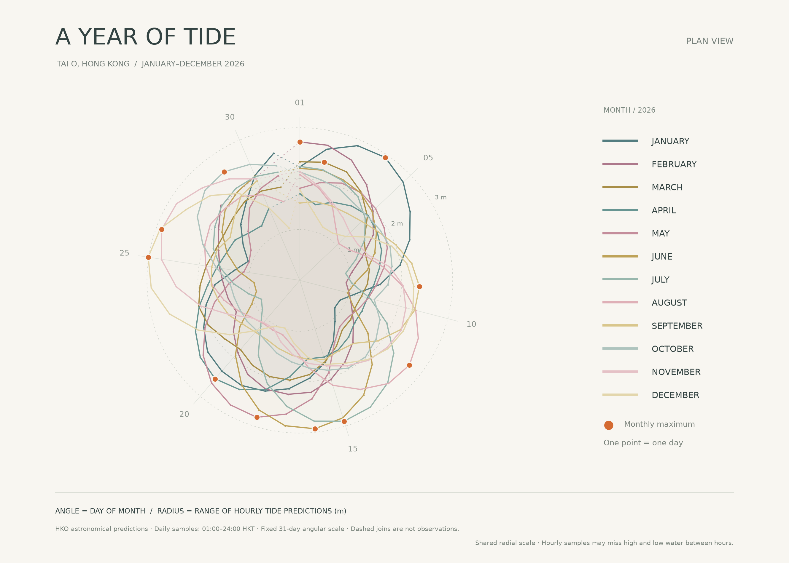

# A Year of Tide — Tai O



## The phenomenon

The height of the sea at Tai O changes through the day. This project explores how the spread between the highest and lowest hourly predictions changes across 2026. I chose a circular composition to compare the monthly rhythms as overlapping outlines. Muted blue-green, pink and yellow shades keep the twelve layers light, while orange points identify the largest daily range in each month. The final image uses a flat view and one shared scale so that the outlines can be compared without perspective distortion.

## The source

The source is the Hong Kong Observatory's [2026 hourly astronomical tide predictions for Tai O](https://data.gov.hk/en-data/dataset/hk-hko-rss-hourly-heights-of-tides/resource/3b59d10d-c132-4042-8598-b60227e8d8a7), downloaded from the [JSON endpoint](https://data.weather.gov.hk/weatherAPI/opendata/opendata.php?dataType=HHOT&station=TAO&year=2026&rformat=json) and saved unchanged in `data/tides-TAO-2026.json`.

The file contains 365 daily rows and 8,760 predicted heights. Each row gives the month, day, and 24 heights at 01:00 through 24:00 Hong Kong Time (UTC+8). Heights are in metres above Chart Datum, as described in the [official field specification](https://data.weather.gov.hk/weatherAPI/hko_data/tide/File_layout_for_predicted_tides_en.pdf). These are astronomical predictions, not observations of actual sea level. For every row, the script subtracts the smallest hourly value from the largest; the resulting range is also in metres. Extremes between hourly samples are not captured.

## What the picture shows

Each month follows the same clockwise, 31-position day-of-month scale, with day 1 at the top and radius representing that day's range of hourly predictions; shorter months have fewer data points, and dashed joins close the outlines without inventing measurements. The orange markers show each month's maximum, with the largest annual sampled range reaching 3.01 m on 25 December. Reducing 24 heights to one number hides the timing and order of high and low water, while overlaying calendar months separates adjacent months and does not establish a common lunar phase.

## Run it

```sh
uv run fetch.py
uv run plot.py
```
